<!-- ==============================================================================
     JHARLYOK GITHUB PROFILE TEMPLATE (README.template.md)
     Edita este archivo con total libertad para personalizar tu perfil.
     
     Puedes agregar texto libre, encabezados, citas, listas o secciones donde desees.
     Etiquetas disponibles para insertar componentes:
       - {header}             : Cabecera animada con typewriter y highlight cards
       - {stats}              : Banner terminal (880px) de estadísticas de GitHub
       - {banner}             : Editor Neovim con tu configuración TypeScript
       - {projects}           : Terminal con árbol de proyectos activos
       - {stack}              : Matriz terminal de tecnologías y herramientas
       - {connect}            : Tarjeta terminal de canales de comunicación
       - {badge:telegram}     : Badge individual de Telegram
       - {badge:discord}      : Badge individual de Discord
       - {badge:email}        : Badge individual de Email
       - {badges}             : Todos los badges de redes sociales configurados
       - {telemetry}          : Badges en vivo de métricas de GitHub (followers, repos, stars, views)
       - {beacon}             : Contador de visitas invisible
       - {footer}             : Pie de página del sistema
     ============================================================================== -->

<!-- HEADER — unified animated welcome typewriter + 4 active systems cards -->
<a href="https://github.com/JharlyOk">
  <picture>
    <source media="(prefers-color-scheme: dark)" srcset="assets/header-dark.svg">
    <source media="(prefers-color-scheme: light)" srcset="assets/header-light.svg">
    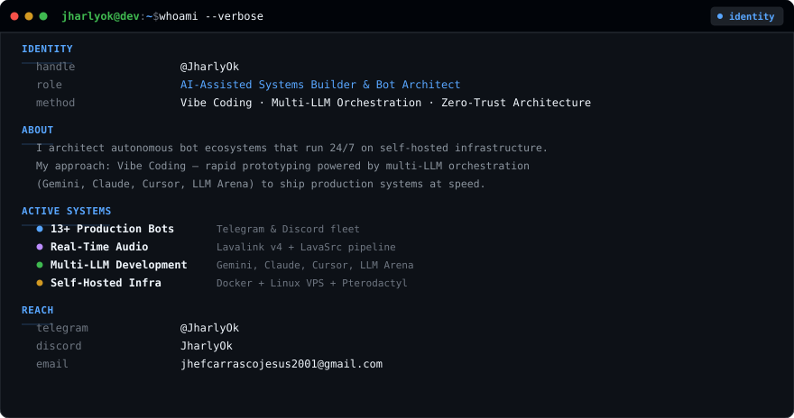
  </picture>
</a>

  

<!-- GITHUB STATS & TELEMETRY DASHBOARD (Terminal) -->
<picture>
  <source media="(prefers-color-scheme: dark)" srcset="assets/stats-dark.svg">
  <source media="(prefers-color-scheme: light)" srcset="assets/stats-light.svg">
  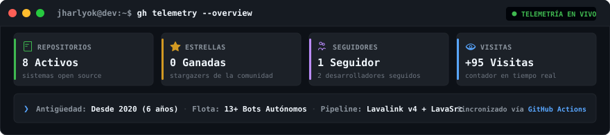
</picture>

  

<a href="https://t.me/JharlyOk">
  <picture>
    <source media="(prefers-color-scheme: dark)" srcset="assets/badges/telegram-dark.svg">
    <source media="(prefers-color-scheme: light)" srcset="assets/badges/telegram-light.svg">
    
  </picture>
</a>
&nbsp;
<a href="https://discord.com">
  <picture>
    <source media="(prefers-color-scheme: dark)" srcset="assets/badges/discord-dark.svg">
    <source media="(prefers-color-scheme: light)" srcset="assets/badges/discord-light.svg">
    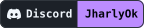
  </picture>
</a>
&nbsp;
<a href="mailto:jhefcarrascojesus2001@gmail.com">
  <picture>
    <source media="(prefers-color-scheme: dark)" srcset="assets/badges/email-dark.svg">
    <source media="(prefers-color-scheme: light)" srcset="assets/badges/email-light.svg">
    
  </picture>
</a>

  

<!-- CODE MANIFEST — TypeScript profile configuration (Neovim editor) -->
<picture>
  <source media="(prefers-color-scheme: dark)" srcset="assets/banner-dark.svg">
  <source media="(prefers-color-scheme: light)" srcset="assets/banner-light.svg">
  
</picture>

  

<!-- ACTIVE PROJECTS — fleet portfolio overview (Terminal) -->
<picture>
  <source media="(prefers-color-scheme: dark)" srcset="assets/projects-dark.svg">
  <source media="(prefers-color-scheme: light)" srcset="assets/projects-light.svg">
  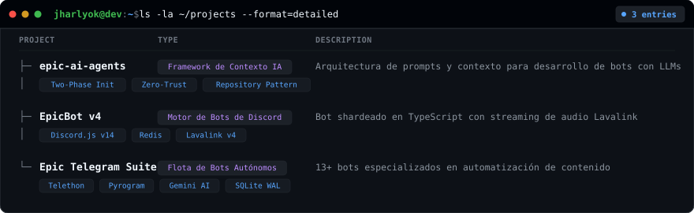
</picture>

  

<!-- TECHNOLOGY STACK — categorized toolchain matrix (Terminal) -->
<picture>
  <source media="(prefers-color-scheme: dark)" srcset="assets/stack-dark.svg">
  <source media="(prefers-color-scheme: light)" srcset="assets/stack-light.svg">
  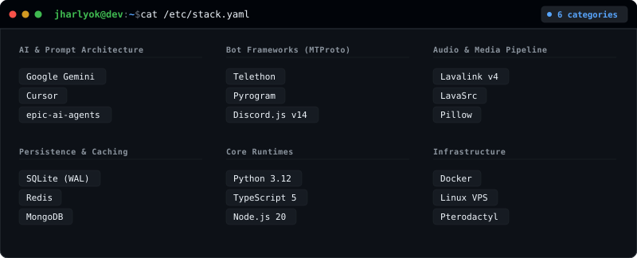
</picture>

  

<!-- CONNECT & ENDPOINTS CARD (Terminal) -->
<picture>
  <source media="(prefers-color-scheme: dark)" srcset="assets/connect-dark.svg">
  <source media="(prefers-color-scheme: light)" srcset="assets/connect-light.svg">
  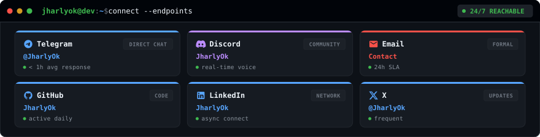
</picture>

  

<!-- DYNAMIC TELEMETRY & GITHUB METRICS -->
<a href="https://github.com/JharlyOk?tab=followers">
  <picture>
    <source media="(prefers-color-scheme: dark)" srcset="assets/badges/followers-dark.svg">
    <source media="(prefers-color-scheme: light)" srcset="assets/badges/followers-light.svg">
    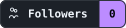
  </picture>
</a>
&nbsp;
<a href="https://github.com/JharlyOk?tab=repositories">
  <picture>
    <source media="(prefers-color-scheme: dark)" srcset="assets/badges/repos-dark.svg">
    <source media="(prefers-color-scheme: light)" srcset="assets/badges/repos-light.svg">
    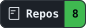
  </picture>
</a>
&nbsp;
<a href="https://github.com/JharlyOk?tab=stars">
  <picture>
    <source media="(prefers-color-scheme: dark)" srcset="assets/badges/stars-dark.svg">
    <source media="(prefers-color-scheme: light)" srcset="assets/badges/stars-light.svg">
    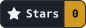
  </picture>
</a>
&nbsp;
<a href="https://komarev.com/ghpvc/?username=JharlyOk">
  <picture>
    <source media="(prefers-color-scheme: dark)" srcset="assets/badges/views-dark.svg">
    <source media="(prefers-color-scheme: light)" srcset="assets/badges/views-light.svg">
    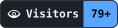
  </picture>
</a>
&nbsp;

  

<!-- VISITOR HIT BEACON -->

  

Built with a custom SVG engine · Dark/Light adaptive · Config-driven · <a href="scripts/">View source</a>

